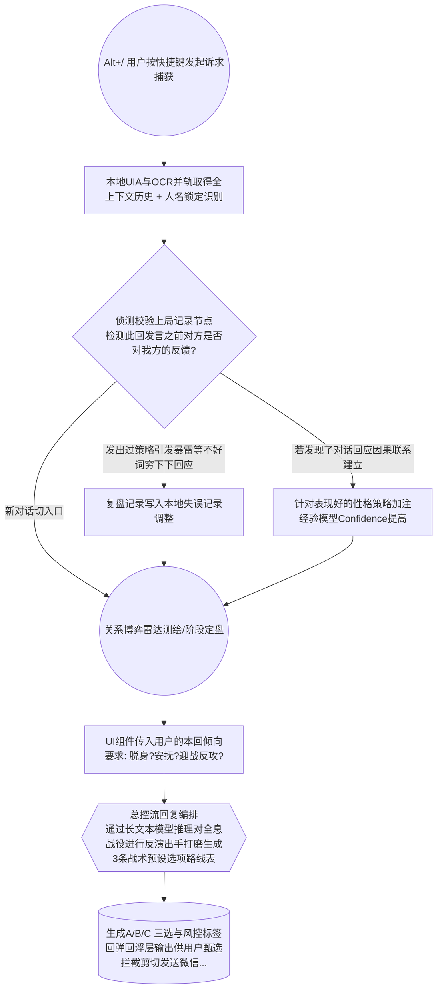

这份**《“伴聊悬浮舱(Context-Pod)”高感知对话操作系统技术白皮书》**，深度整合了我们此前所有的业务洞察与技术重构逻辑。

这不仅仅是一份软件设计文档，更是针对现代社交博弈的一套“可落地工程规范”。我使用 TypeScript 接口、数据建模和架构流程图将其沉淀为了**可以直接发给高级前端和架构师按图索骥进入开发的基准（Baseline）文件**。

---

# 🛸 “伴聊悬浮舱(Context-Pod)” 高感知对话操作系统技术白皮书 V2.0

## 1. 摘要与愿景 (Executive Summary)
“伴聊悬浮舱”彻底摒弃了市面上主流的“一次性 Prompt 套壳生成”思路，转型为首个专为高净值沟通场景打造的**局部关系操作系统 (Local Relational Operating System)**。
系统基于完全离线安全保护机制运行在桌面系统后台。它包含长效记忆推演、博弈状态机判定以及后验微学习反馈循环（Micro-RLAIF）。最终产出的不仅是应对建议，更是包含了策略透视、对手推演以及潜在风险警告的高阶博弈视角。

## 2. 系统技术架构概览 (Technology Stack)

我们以轻量、极速、高整合度为准则搭建。

*   **底层应用宿主 (Host):** Tauri v2 (Rust + Vue3 Composition API) - 确保体积控制在 < 20MB。
*   **前端视觉容器 (Client):** TailwindCSS + Vue3。利用透明包裹层结合 `padding` + `box-shadow` 设计，解决底层透明渲染难题。
*   **上下文侦听核心 (Eyes):** 基于 Rust `UIAutomation` 进行底层窗口原生捕获为主，Local RapidOCR-Node 作为备选。
*   **向量库与存储持久化 (Storage):** 本地 LanceDB (配合 `Transformers.js` 提供基于浏览器的无感知 Embedding 操作) 与 SQLite 记录库。
*   **主中枢思维网 (Brain):** Vercel AI SDK 负责终端流输出；核心采用 **LangGraph.js** 处理所有复杂 Agent 跳转拓扑网络设计（核心业务编排库）。

---

## 3. 数据重构核心篇 (Data Schema: Memory Engine)

为了让系统的灵魂变得真实而持续（放弃单纯的覆盖记录模式），所有的特性都基于增量发现（Incremental Tracking）系统结合**权重与衰减性指标设计**记录结构：

```typescript
// 类型：动态心智映射图谱数据库接口约束
interface DynamicPersonaSchema {
  targetId: string;       // 精准锁定唯一特征绑定人员(如:U_wxID_52xx)
  updateTick: number;     // 更新频率与时间，管理数据的衰减状态

  // 一、权利与底色结构 （带多频权重复演验证法）
  powerIdentity: Array<{
    trait: string;          // 如: "喜欢建立权威感 / 吃软不吃硬"
    confidence: number;     // 把握程度(0.0-1.0，多次观察相同可叠高)
    observationsCount: number;// 被证实次数
    decayRate: number;      // 针对偶尔的情感外溢状态定期消除设定
  }>;
  
  // 二、核心内源性需要和心理倾向
  psychologicalNeeds: Array<{
    need: string;          // 例如 "高度的细节把控感和执行预期确认"
    weight: number;        // (0-1.0的需要优先级比对程度值)
  }>;

  // 三、语言沟通禁区高红线控制台
  taboos: Array<{
    rule: string;          // 绝忌踩触红线行为 ("严禁大面积发小红书废话长句子，禁用不确定助词")
    riskFactor: number;    // 当前操作可能造成事故级别的爆表阈值测度估数。
  }>;
}

// 态势监控日志：记忆微更新增量结构 (针对长期的记录微更操作）
interface ExperienceEvent {
   behaviorTrendDesc: string; // 用语言总结提取发生变化的最新特质(例如这20局：明显不爽语气变快）。
}
```

---

## 4. LangGraph 逻辑全盘工作引擎推演流水图（Pipeline Logic）

这里展现的是单次用户在桌面唤出小飞碟外挂之后的运行周期底层调度图网络 `Pipeline Engine`：



**TypeScript 下的状态机与生成管线（Graph 定义展示部分精华节选）：**
利用 Langchain / Graph 提供图管理方法来实现你的设想概念设计！

```typescript
// src/services/BrainCoreOrchestration.ts
import { StateGraph, END } from "@langchain/langgraph";

// 定义整段推流共享的信息实体 (Global Flow Variables State Data Structure ) 
type ConversationSessionState = {
   rawConvoArray: string[]; // 最近3分钟被获取到的全流信息数据文本池
   tacticalGoalParam: string; //  用户 UI层下拉单选设定 ：如: "立即中止本次纠缠下桌退下"，"极尽拍马屁提供价值" 
   evaluatedPhaseId: string; // 雷达确定的: 例如 ”3-冰河危机对峙期"
   targetIdName: string; // 当前针对：”主管王x“ 
   historicalEvaluationsSummary: string; // 长史复盘小记  (包含着所有他失败发后的警示总结以及他人的癖好信息)。
   proposedCardsOutputArray: any